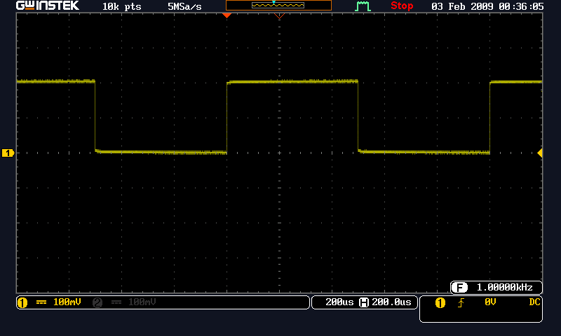

# instrument-com
Support many methods to communication with instrument through ethernet or usb

Now it only support GWINSTE's GDS2000E series

# Example
You can direct use known port and ip to create a new instance 
```js
var dsoDriver = require('./index.js');

// create a new instance and bind to ethernet interface with ip:172.16.5.68 and port:3000
var dsoCtrl=dsoDriver.DsoNet(3000,'172.16.5.68');

// connect to instrument , connect must be done before any operation.
dsoCtrl.connect().then(dsoCtrl.run);

```
Or you can browse which one you want to
```js
var dsoDriver = require('./index.js');
var dsoCtrl, i, len ;


/*
 * .showNetDevice use mdsn to browse available device
 * @return (Array Object) [ { name, port, addr } , ...]
 */
var deviceList = dsoDriver.showNetDevice();
len = deviceList.length
for( i = 0; i < len; i += 1 ){
  if(deviceList[i].name === 'GDS2102E-01' ){
    dsoCtrl = deviceList.DsoNet( deviceList[i].port, deviceList[i].addr );
    break;
  }
}

if(dsoCtrl === undefined){
  console.log('GDS2000E not available');
  process.exit(1);
}

dsoCtrl.connect().then(dsoCtrl.run);

```


# API
* [showNetDevice( )](#show-avaiable-device)
* [DsoNet( port, address )](#create-new-instance-via-ethernet)
* [DsoUSB( vid, pid )](#create-new-instance-via-usb)

## Show avaiable device  
Find all instrument-dso service using [mdns](https://www.npmjs.com/package/mdns). When DSO socket server on, you can use showNetDevice() to count available DSO,
and showNetDevice() will return an array object that store dso's name, port and ip like this
```js
[ {name:'GDS2102E-01',port:'3000', addr:'172.16.5.111'}
 ,{name:'GDS2102E-02',port:'3000', addr:'172.16.5.112'} ]
```

## Create new instance via Ethernet
Use DsoNet( port, address ) to create a new instance that contains many methods to control remote DSO via ethernet.
Remote DSO has a port and ip address to identify it self, use unique port and ip address to pass to DsoNet() and DsoNet() will return an object to control that remote DSO 
```js
var dsoCtrl=dsoDriver.DsoNet(3000,'172.16.5.68');
console.log( dsoCtrl );
```
## Create new instance via USB
You can use one of DsoNet() or dsoUSB() to create a new instance but can't use both.

# Methods
When dsoCtrl object was created, you can use many methods to control device.
* [.connect( )](#connect)
* [.disconnect( )](#disconnect)
* [.syncConfig( )](#syncconfig)
* [.enableCh( ch )](#enablech)
* [.disableCh( ch )](#disablech)
* [.getHorizontal( )](#gethorizontal)
* [.setHorizontal( hor )](#sethorizontal)
* [.getVertical( ch )](#getvertical)
* [.setVertical( ch )](#setvertical)
* [.getEdgeTrig( )](#getedgetrig)
* [.setEdgeTrig( )](#setedgetrig)
* [.getSnapshot( )](#getsnaphot)
* [.getRawdata( ch )](#getrawdata)
* [.getMeas( mch )](#getmeas)
* [.supportedMeasType( )](#supportedmeastype)
* [.setMeas( { mch, src1, src2, type } ) ](#setmeas)
* [.statisticOn( )](#statisticon)
* [.statisticOff( )](#statisticoff)
* [.statisticWeight( weight )](#statisticweight)
* [.run( )](#run)
* [.stop( )](#stop)
* [.single( )](#single)
* [.autoset( )](#autoset)
* [.force( )](#force)
* [.closeDev( )](#closedev)

##.connect
Connect to device, create a connection to the device, if return with no error, the other methods can be useed
```js
// create a new instance and bind to ethernet interface with ip:172.16.5.68 and port:3000
var dsoCtrl=dsoDriver.DsoNet(3000,'172.16.5.68');

// connect to instrument , connect must be done before any operation.
dsoCtrl.connect()
  .then(dsoCtrl.run);
```
##.disconnect
Disconnect from device, if nothing else to do, disconnect from the device.
```js
  dsoCtrl.dsiconnect().then(dsoCtrl.closeDev);
```
##.syncConfig
##.enableCh
Turn remote DSO's channel on
```js
//turn channel 1 on
dsoCtrl.connect()
  .then(dsoCtrl.enableCh('ch1'));
```
##.disableCh
Turn remote DSO's channel off
```js
//turn channel 1 off
dsoCtrl.connect()
  .then(dsoCtrl.disableCh('ch1'));
```
##.getHorizontal
Return current remote DSO's horizontal system setting
```js
dsoCtrl.connect()
    .then(function(){
        dsoCtrl.getHorizontal()
            .then(function(res){
                console.log(res);
            });
    });
```
Console displayed infomation
```js
 { temp: 0,
  position: '0.000E+00',
  zposition: '0.000E+00',
  scale: '1.000000e-04',
  zscale: '1.000E-05',
  mode: 'MAIN',
  expand: 'CENTER',
  prop: { get: [Function], set: [Function] } }
```
The meaning of the return object
* temp: never mind
* position: offset of the waveform trace in time axis
* scale: a waveform trace can be cut into 10 block, the scale is the time of a block
* zscale: never mind
* mode: nerver mind
* expand: never mind
* prop: never mind

##.setHorizontal
setHorizontal( _hor_ ), setup remote DSO's horizontal system, _hor_ is an object that include position,zposition,scale,zscale,mode,expand. Those parameter have some limitation.

You can pass parameter only you care
```js
dsoCtrl.connect()
    .then(function(){
        dsoCtrl.setHorizontal({ position:'2.000E-04', scale:'2.0E-04'})
            .then(function(){
                console.log('done');
            })
            .catch(function(err){
                console.log('catch error: '+err);
            })
    })
    .then(dsoCtrl.stop)
    .catch(function(){
        console.log('dsoCtrl error');
    });
```
We set the position to 200us and set the scale to 200us


##.getVertical
Return current remote DSO's vertical system setting
```js
dsoCtrl.connect()
    .then(function(){
        dsoCtrl.getVertical('ch1')
            .then(function(res){
                console.log(res)
            });
    })
    .catch(function(){
        console.log('dsoCtrl error');
    });
```
Console displayed infomation
```js
{ coupling: 'DC',
  impedance: '1E+6',
  invert: 'OFF',
  bandwidth: 'FULL',
  expand: 'GND',
  state: 'ON',
  scale: '1.000E-01',
  position: '0.000E+00',
  deskew: '0.000e+00',
  rawdata: <Buffer 00 00 00 00 00 00 00 00 00 00 00 00 00 00 00 00 60 00 00 03 01 00 00 00 78 00 00 03 01 00 00 00 90 00 00 03 01 00 00 00 01 00 00 00 00 00 00 00 ff ff ... >,
  raw_state: '0',
  probe: { unit: 'VOLTAGE', atten: '1.000000e+00' },
  dataCount: 0,
  recCount: 0,
  id: 'ch1',
  prop: { get: [Function], set: [Function] } }
```
##.setVertical
Setup remote DSO's vertical system
##.getEdgeTrig
Retrun current remote DSO's edge trigger setting
##.setEdgeTrig
Setup remote DSO's edge trigger
##.getSnaphot
Return an RLE buffer that store screen data displayed on remote DSO
```js
dsoCtrl.connect()
    .then(function(){
        dsoCtrl.getSnapshot()
            .then(function(res){
                console.log(res)
            });
    })
    .catch(function(){
        console.log('dsoCtrl error');
    });
```
##.getRawdata
Return sampled value, each two int8 bytes encodes the vertical data of a data point, and store in big endian format
##.getMeas
Return measurement value for selected measurement source
##.supportedMeasType
Return suppoted measurement type
##.setMeas
Setup measurement type for selected measurement source
##.statisticOn
Turn statistic measure on for all measurement source
##.statisticOff
Turn statistic measure off for all measurement source
##.statisticWeight
Setup statistic weighting
##.run
Turn remote DSO into run state
##.stop
Turn remote DSO into stop state
##.single
Turn remote DSO into single state
##.autoset
Turn remote DSO into autoset state
##.force
Turn remote DSO into force state
##.closeDev
Close opened device

#Error Message
You can use promise catch method to catch error message
```js
dsoCtrl.connect()
    .then(function(){
        dsoCtrl.setHorizontal({ position:'-1E7',
                                scale:'2.0E-04'
                            })
            .then(function(){
                console.log('done');
            })
            .catch(function(err){
                console.log(err);
            })
    })
```
Console displayed information
```js
[ '-500',
  '\'-1e+7\' argument does not accept, set to near one -5.000E+01\n' ]

```
Array[0] show error type 

* -100 : Parameter Error
* -200 : Execution Error
* -300 : Device-specific Error
* -400 : Query Error
* -500 : Parameter Not Accept

Array[1] show error message

